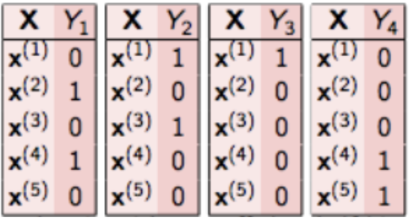
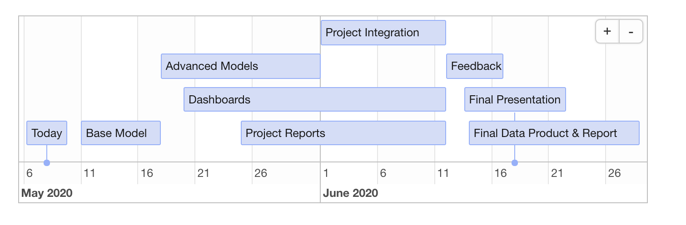

```{r setup, include=FALSE}
knitr::opts_chunk$set(echo = FALSE)
```

```{r load_packages, warning=FALSE}
library(vegawidget)
library(reticulate)
library(timevis)
use_python('/usr/local/bin/python')
```

```{python libraries_import, include=FALSE}
import pandas as pd
import numpy as np
import altair as alt
```

## Introduction

<div class= "columns-2">


<br>  

**Work Environment Survey (WES)**  
 
  - Survey conducted by BC Stats for employees of BC Public Service.
  
  - Measures the health of the work environments.
  
  - 80 multiple choice questions (5 point scale) and 2 open-ended questions.
  
  - 2013, 2015, 2018, and 2020 across 26 Ministries.
  
</div>

## Introduction | Open-ended Questions

Question 1

### <b> <span style="color:#005c99">
What one thing would you like your organization to focus on to improve your work environment? </span></b>


<br>

Question 2

### <b> <span style="color:#005c99">
Have you seen any improvements in your work environment and if so, what are the improvements?
</span> </b>


## Objectives 

**Overarching goal:  
Use automated multi-label theme classification of comments to themes and subthemes.**

 **Question 1**

- <span style="color:#005c99">Improve accuracy</span> for predicting label(s) for main <span style="color:#005c99">themes</span> respective of previous capstone project results.
- <span style="color:#005c99">Build a model</span> for predicting label(s) for <span style="color:#005c99">sub-themes</span>.
- Scalability: Identify <span style="color:#005c99">trends across ministries</span> and over the four specified years.

<br>

**Question 2**

- <span style="color:#005c99">Identify labels</span> for theme classification and compare with existing labels.
- Create <span style="color:#005c99">visualizations for executives</span> to explore the results.

## EDA | Question 1

**Data**<br>
Labeled data from 2013, 2018, 2020. Added to around 32,000 respondents.

<br>
**Dataset format**<br>
Responses for this question are captured and labeled (theme and sub-theme) by hand:

|Comments*|CPD|CB|EWC|...|CB_Improve_benefits|CB_Increase_salary|
|:----|:---:|:---:|:---:|:---:|:---:|:---:|
|Better health and social benefits should be provided|0|1|0|...|1|0|

<br>
**Theme**: CB = Compensation and Benefits
<br>

**Sub-theme**: CB_Improve_benefits = Improve benefits
<br>
<br>

<font size="3"> *Note: this is a fake comment as an example of the data. </font>

## EDA | Question 1
Labels: <span style="color:#005c99">13 themes</span> and <span style="color:#005c99">63 sub-themes</span>.

```{python}
#reading in the train data for themes
data_train_q1 = pd.read_csv('../data/y_train.csv')

#reading in theme codes to names csv
code_names = pd.read_csv('../data/theme_to_codes.csv')

# wrangling train data for counts per theme
theme_data = data_train_q1.iloc[:, list(range(12))+[-1]]
theme_table = pd.DataFrame(np.sum(theme_data, axis=0)).reset_index()
theme_table.rename(columns={'index':'theme_codes', 0:'count'}, inplace=True)

theme_table_final = pd.merge(theme_table, code_names)

theme_chart_q1 = alt.Chart(theme_table_final, width=500, height=200, title='Number of comments for themes in training data').mark_bar().encode(
    x=alt.X('theme_names:N', sort='-y', title = 'themes'),
    y=alt.Y('count:Q')
).configure_axisX(
    labelAngle = -45
).to_json()
```

```{r}
as_vegaspec(py$theme_chart_q1)
```

<br>
Label cardinality for themes: **~1.4**

## EDA | Question 1
```{python}
data_train_num_q1 = pd.read_csv('../data/y_train_num.csv')
codes = pd.read_csv('../data/theme_code_names.csv')
subtheme_y_data = data_train_num_q1.iloc[:, 12:99]
subtheme_y_data = subtheme_y_data.fillna(0)
subtheme_count = pd.DataFrame(np.sum(subtheme_y_data, axis=0)).reset_index()
subtheme_count.rename(columns={'index':'subtheme_code', 0:'count'}, inplace=True)
subtheme_count['theme_code'] = subtheme_count['subtheme_code'].str.split('.').str[0]
subtheme_count['theme_code'] = pd.to_numeric(subtheme_count['theme_code'])
```

```{python}
final_train_subtheme_table = pd.merge(subtheme_count, codes)
facet_chart = alt.Chart(final_train_subtheme_table, title = 'Comments per sub-themes in training dataset', height=75, width=100).mark_bar().encode(
    x=alt.X('subtheme_code:N', 
            title=None,
            sort=alt.EncodingSortField(field='count')),
    y=alt.Y('count:Q')
).facet(
    facet = 'theme_name:O',
    columns = 4
).resolve_scale(
    x='independent'
).to_json()
```

```{r}
library(vegawidget)
as_vegaspec(py$facet_chart)
```

Label cardinality for sub-themes: **~1.6**

## EDA | Question 2

**Data**

- Labeled data from 2018 (around 6,000 respondents).  
- Unlabeled data from 2015 and 2020 (9,000 additional comments).

<div class= "columns-2">
```{python}
# reading in training data  
y_train_q2 = pd.read_csv('../data/y_train_q2.csv')

# wrangling training data to get count of comments per label
q2_class_df = pd.DataFrame(np.sum(y_train_q2)).reset_index()
q2_class_df = q2_class_df.rename(columns={'index':'themes', 0:'count'})

theme_count_q2 = alt.Chart(q2_class_df, width=400, title='Number of comments for themes in training data').mark_bar().encode(
    x=alt.X('themes:N', sort='-y', title = 'themes'),
    y=alt.Y('count:Q')
).configure_axisX(
    labelAngle = -45
).to_json()
```


```{r}
as_vegaspec(py$theme_count_q2)
```

<div>

<br>
<br>
Labels for 2018: <span style="color:#005c99">6 themes</span> and <span style="color:#005c99">16 sub-themes</span>

<br>
Label cardinality: **~1.6**
</div>

## Challenges
- <span style="color:#005c99">Achieve desired accuracy</span> with Multi-label classification model having high number of labels.

<br>

- <span style="color:#005c99">Class Imbalance</span> in the data
  - skeweness in number of comments per label.

<br>

- Low label cardinality indicating <span style="color:#005c99">sparsity</span> in training data
  - ~2 labels per comment from ~60 labels.

## Techniques | Question 1
<span style="color:#005c99">Binary Relevance</span> - Base Model from last year's Captsone



<br>
*Source* - [Multi-Label Classification: Binary Relevance, by Analytics Vidhya](https://www.analyticsvidhya.com/blog/2017/08/introduction-to-multi-label-classification/)


## Techniques | Question 1
<span style="color:#005c99">Classifier Chains</span> - Proposed Base Model


<br>

- Multi-Label Classification using TF-IDF Vectorizer with Classifier Chain.

<br>
*Source* - [Multi-Label Classification: Classifier Chains, by Analytics Vidhya](https://www.analyticsvidhya.com/blog/2017/08/introduction-to-multi-label-classification/)


## Techniques | Question 2

**Theme Identifications**

- Use clustering algorithms like <span style="color:#005c99">PCA</span> and <span style="color:#005c99">Topic Modelling</span>

<br>
<br>

**Scalability**

- Descriptive Statistics using Matplotlib, Altair and Plotly
  - Identify trends over the years
  - Identify trends across Ministries


## Deliverables

- **<span style="color:#005c99">Data pipeline</span> with the documentation for our models**

<br>

- **<span style="color:#005c99">Dash app</span> that displays the trends across ministries for both the qualitative questions**


## Timeline

```{r timeline, include=FALSE}
data <- data.frame(
  id      = 1:7,
  content = c("Today"  , "Base Model"  ,"Advanced Models","Dashboards","Project Reports", 
               "Project Integration", "Feedback"),
  start   = c("2019-05-08", "2019-05-11", "2019-05-18", "2019-05-20" ,"2019-05-25", "2019-06-01", "2019-06-12"),
  end     = c(NA          , "2019-05-18", "2019-06-01","2019-06-12","2019-06-12", "2019-06-12", "2019-06-17"),
  editable = TRUE
)

timevis(data, options = list( showCurrentTime = FALSE))

```



