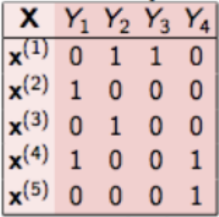
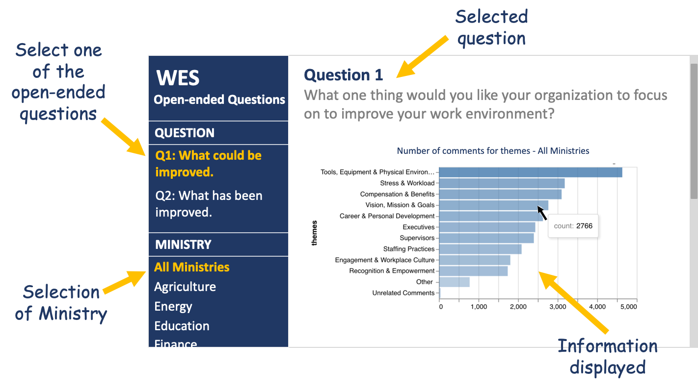

```{r setup, include=FALSE}
knitr::opts_chunk$set(echo = TRUE)
```

```{r load_packages, warning=FALSE, include=FALSE}
library(vegawidget)
library(reticulate)
library(timevis)
use_python('/usr/local/bin/python')
```

```{python libraries_import, include=FALSE}
import pandas as pd
import numpy as np
import altair as alt
```

# Executive Summary

<span style="color:darkred">A brief and high level summary of the project proposal.</span>  
**We should write this section after we finish the proposal.**

<br>

# Introduction

*"I believe a well performing government, one that meets  
the service expectations of British Columbians, can only  
be achieved through a strong, highly competent and  
committed public service."*<br>
<span style="color:gray">- Wayne Strelioff, Auditor General of British Columbia<span>

### Work Environment Survey (WES)


<style>
.column-left{
  float: left;
  width: 40%;
  text-align: center;
}
.column-center{
  float: right;
  width: 60%;
  text-align: left;
}
</style>

<div class="column-left">
  {width=70% fig.align="center"}
</div>
<div class="column-center">
Since 2006, the BC Public Service has conducted the Work Environment Survey (WES) with the goal of understanding their employees' experience, celebrating their successes, and identifying areas for improvement. The survey consists of ~80 multiple choice questions, in 5-point scale, and two open ended questions:
</div>


<br>

**Question 1.** <span style="color:#005c99">**What one thing would you like your organization to focus on to improve your work environment?** </span>

  <span style="color:gray">*Example^[This is a fake comment as examples of the data.]: "Better health and social benefits should be provided."*</span>

**Question 2.** <span style="color:#005c99">**Have you seen any improvements in your work environment and if so, what are the improvements?**</span>

  <span style="color:gray">*Example^[Idem.]: "Now we have more efficient vending machines."*</gray>


The responses to the first question have been manually coded into 13 themes and 63 sub-themes, and for the second question it has been manually coded into 6 themes and 16 sub-themes.

<br>
<br>
<br>

# Objectives 

Our project aims to apply natural language processing and machine learning classification on these open-ended questions to automate the process.

The specific objectives for each question are:

**Question 1**

- <span style="color:#005c99">Build a model</span> for predicting label(s) for main <span style="color:#005c99">themes</span>.

- <span style="color:#005c99">Build a model</span> for predicting label(s) for <span style="color:#005c99">sub-themes</span>.

- Scalability: Identify <span style="color:#005c99">trends across ministries</span> and over the four specified years.

**Question 2**

- <span style="color:#005c99">Identify labels</span> for theme classification and compare with existing labels.

- Create <span style="color:#005c99">visualizations for executives</span> to explore the results.

<br>

It is important to mention that the first question has been addressed by previous Capstone projects of MDS Students. In specific, the BC Stat’s Capstone of 2019 (Quinton, Pearson, Nie), built a model that predicts the labels of the main themes, and reached the following results:

{width=80% fig.align="center"}

*Source: [Final Report of BC Stats Capstone 2019, by Quinton,Pearson and Nie.](https://github.com/aaronquinton/mds-capstone-bcstats/blob/master/reports/BCStats_Final_Report.pdf)*

In this case, our aim is to improve the accuracy for predicting labels for main themes respective the results of the 2019 BC Stats Capstone Project.

<br>

# Getting Familiar with the Data

The Data consist of separated files for each question, and for each of the years (2013, 2015, 2018, 2020), in Microsoft Excel format (.xlsx), and contain sensitive information from employees of BC Public Services.


In specific, the information that we would use for this project for the first question corresponds to the labeled data from 2013, 2018, 2020, that added to around 32,000 respondents.

In the following we can see an example^[This is a fake comment as an example of the data.] of how this question is presented in the database.

|Comments^[This is a fake comment as an example of the data]|CPD|CB|EWC|...|CB_Improve_benefits|CB_Increase_salary|
|:----|:---:|:---:|:---:|:---:|:---:|:---:|
|Better health and social benefits should be provided|0|1|0|...|1|0|

<br>

The classification of the previous comment is CB (Compensation and Benefits) for theme, and CB_Improve_benefits (Improve benefits) as sub-theme.

For the second question, we have labeled data from 2018, which add around 6,000 respondents. Also, we have unlabeled data from 2015 and 2020, that represent 9,000 additional comments.


# Exploratory Data Analysis

**Question 1.**
<br>
<span style="color:grey">**What one thing would you like your organization to focus on to improve your work environment?** </span>

Labels: <span style="color:#005c99">13 themes</span> and <span style="color:#005c99">63 sub-themes</span>.

<center>
```{python, echo=FALSE}
#reading in the train data for themes
data_train_q1 = pd.read_csv('../data/y_train.csv')

#reading in theme codes to names csv
code_names = pd.read_csv('../data/theme_to_codes.csv')

# wrangling train data for counts per theme
theme_data = data_train_q1.iloc[:, list(range(12))+[-1]]
theme_table = pd.DataFrame(np.sum(theme_data, axis=0)).reset_index()
theme_table.rename(columns={'index':'theme_codes', 0:'count'}, inplace=True)

theme_table_final = pd.merge(theme_table, code_names)

theme_chart_q1 = alt.Chart(theme_table_final, width=500, height=250, title='Number of comments for themes in training data').mark_bar().encode(
    y=alt.Y('theme_names:N', sort='-x', title = 'themes'),
    x=alt.X('count:Q'),
    opacity=alt.Opacity('count:Q', legend=None),
    tooltip='count:Q'
).configure_axisX(
    #labelAngle = -45
).to_json()
```

```{r, echo=FALSE}
as_vegaspec(py$theme_chart_q1)
```
</center>
Label cardinality for **themes**: **~1.4**


```{python, echo=FALSE}
data_train_num_q1 = pd.read_csv('../data/y_train_num.csv')
codes = pd.read_csv('../data/theme_code_names.csv')
subtheme_y_data = data_train_num_q1.iloc[:, 12:99]
subtheme_y_data = subtheme_y_data.fillna(0)
subtheme_count = pd.DataFrame(np.sum(subtheme_y_data, axis=0)).reset_index()
subtheme_count.rename(columns={'index':'subtheme_code', 0:'count'}, inplace=True)
subtheme_count['theme_code'] = subtheme_count['subtheme_code'].str.split('.').str[0]
subtheme_count['theme_code'] = pd.to_numeric(subtheme_count['theme_code'])
```
<center>
```{python, echo=FALSE}
final_train_subtheme_table = pd.merge(subtheme_count, codes)
facet_chart = alt.Chart(final_train_subtheme_table, title = 'Comments per sub-themes in training dataset', height=70, width=125).mark_bar().encode(
    x=alt.X('subtheme_code:N', 
            title="sub-themes",
            sort=alt.EncodingSortField(field='count')),
    y=alt.Y('count:Q'),
    opacity=alt.Opacity('count:Q', legend=None),
    tooltip='count:Q'
).facet(
    facet = 'theme_name:O',
    title = "Comments per sub-themes in training dataset",
    columns = 4
).resolve_scale(
    x='independent'
).to_json()
```

```{r, echo=FALSE}
library(vegawidget)
as_vegaspec(py$facet_chart)
```
</center>
Label cardinality for **sub-themes**: **~1.6**

<br>

**Question 2.**
<br>
<span style="color:grey">**Have you seen any improvements in your work environment and if so, what are the improvements?**</span>

Labels for 2018: <span style="color:#005c99">6 themes</span> and <span style="color:#005c99">16 sub-themes</span>

<center>
```{python, echo=FALSE}
# reading in training data  
y_train_q2 = pd.read_csv('../data/y_train_q2.csv')

# wrangling training data to get count of comments per label
q2_class_df = pd.DataFrame(np.sum(y_train_q2)).reset_index()
q2_class_df = q2_class_df.rename(columns={'index':'themes', 0:'count'})

theme_count_q2 = alt.Chart(q2_class_df, width=500, height=250, title='Number of comments for themes in training data').mark_bar().encode(
    y=alt.Y('themes:N', sort='-x', title = 'themes'),
    x=alt.X('count:Q'),
    opacity=alt.Opacity('count:Q', legend=None),
    tooltip='count:Q'
).configure_axisX(
    #labelAngle = -45
).to_json()
```

```{r, echo=FALSE}
as_vegaspec(py$theme_count_q2)
```
</center>
Label cardinality: **~1.6**

<br>

# Challenges
- <span style="color:#005c99">Decide appropriate metric for evaluating accuracy</span> (considering partial correctness) for multi-label prediction problem.

- Low label cardinality indicating <span style="color:#005c99">sparsity</span> in training data
  - ~2 labels per comment from ~60 labels.

- Build a model with increased performance -<span style="color:#005c99">higher label precision and recall</span>- than the MDS team last year so that it <span style="color:#005c99">can be deployed by BC Stats</span>.

- <span style="color:#005c99">Class Imbalance</span> in the data
  - skeweness in number of comments per label.

<br>

# Data Science Techniques

<span style="color:darkred">**Expectatives of this section:** <br> Describe how you will use data science techniques in the project. Be sure to discuss the appropriateness of the data for the proposed data science techniques, as well as difficulties the data might pose. It is recommended to include a description of the data (variables/features and observational units) and some examples/snippets of what the data looks like (as a table or a visualization).
Be sure to always always start with simple data science techniques to obtain a simple version of your data science product. There are two benefits to this approach. First, the simple method gives you a baseline to which you can compare future results. Second, the simple method may solve the problem, in which case you don't need something more complicated. For example, your first model should not be an LSTM.</span>

<span style="color:green">
**What we had previously in Google Docs**
<br>
Our first question includes labeled data from 2013, 2018, 2020, while the second question has labeled data from 2015, 2018, 2020. Each survey has around __ respondents across __ ministries. 
<br>
Sparsity of the data (cardinality)
Multi-label problem
Create fake comment and labels (we can use real labels)
(insert image of class imbalance figure)
<br>
Initial observations we notice are patterns of class imbalance with the themes and subthemes that may pose an issue with recall and precision in the future. We also observe a low level of label cardinality (average number of labels per comment) so we are dealing with sparsity in our dataset. 
<br>
For automated classification to themes and subthemes tasks, our baseline approach will be to run TF-IDF vectorizer and a Classifier Chains model. The past capstone group used Binary Relevance for their multi-label classification model which treats each label as a separate single class classification problem. In Classifier Chains, the model forms chains in order to preserve label correlation and believe this would be a better choice. 
<br>
For theme identification, our baseline is to use a standard LDA approach. 
For the dashboard, we will be using Matplotlib, Altair and Plotly. The visualizations are focused on:
Identifying trends across the years
Identifying trends across ministries
</span>

### Question 1
<span style="color:#005c99">Binary Relevance</span> - Base Model from last year's Captsone
<center>
  {width=18% fig.align="center"}
</center>
<center>
  {width=32% fig.align="center"}
</center>
<br>
*Source: [Multi-Label Classification: Binary Relevance, by Analytics Vidhya](https://www.analyticsvidhya.com/blog/2017/08/introduction-to-multi-label-classification/)*

<span style="color:#005c99">Classifier Chains</span> - Proposed Base Model
<center>
  {width=25% fig.align="center"}
</center>
<center>
  {width=80% fig.align="center"}
</center>
<br>
*Source: [Multi-Label Classification: Classifier Chains, by Analytics Vidhya](https://www.analyticsvidhya.com/blog/2017/08/introduction-to-multi-label-classification/)*

- Multi-Label Classification using TF-IDF Vectorizer with Classifier Chain.

### Question 2

**Theme Identifications**

- Use clustering algorithms like <span style="color:#005c99">PCA</span> and <span style="color:#005c99">Topic Modelling</span>

**Scalability**

- Descriptive Statistics using Matplotlib, Altair and Plotly
  - Identify trends over the years
  - Identify trends across Ministries
  
<br>

# Deliverables

- **<span style="color:#005c99">Data pipeline</span> with the documentation for our models**

<br>

- **<span style="color:#005c99">Dash app</span> that displays the trends across ministries for both qualitative questions**

<center>
  {width=80% fig.align="center"}
</center>
*Source: Dash app's sketch^[This figure is just for illustrative purpose, the final version of the app could differ from the sketch.], based in [app developed by BC Stats for the Workforce Profiles Report 2018](https://www.analyticsvidhya.com/blog/2017/08/introduction-to-multi-label-classification/).*

<br>

# Timeline

```{r timeline, include=FALSE}
data <- data.frame(
  id      = 1:7,
  content = c("Today"  , "Base Model"  ,"Advanced Models","Dashboards","Project Reports", 
               "Project Integration", "Feedback"),
  start   = c("2019-05-08", "2019-05-11", "2019-05-18", "2019-05-20" ,"2019-05-25", "2019-06-01", "2019-06-12"),
  end     = c(NA          , "2019-05-18", "2019-06-01","2019-06-12","2019-06-12", "2019-06-12", "2019-06-17"),
  editable = TRUE
)

timevis(data, options = list( showCurrentTime = FALSE))

```


Week 1 (May 11-15) - Base Models: classification and topic modelling.  
Week 2 (May 18-22) - Begin working on advanced models & visualizations for dashboard.  
Week 3 (May 25-29) - Continue working with advanced models & start project reports.  
Week 4 (Jun 1-5) - Deliverables & Pipelines continuous integration.  
Week 5 (Jun 8-12) - Report Writing & Documentation.  
Week 6 (Jun 15-16) - Feedbacks & Submissions.  

# References

- BC Stats. (August 2018). 2018 Work Environment Survey Driver Guide. Site: https://www2.gov.bc.ca/assets/gov/data/statistics/government/wes/wes2018_driver_guide.pdf 

- BC Stats. (2018). Workforce Profile Report 2018. Online dashboard. Retrieved 2020-05-08, site https://securesurveys.gov.bc.ca/ERAP/workforce-profiles

- Province of British Columbia. (2020). About the Work Environment Survey (WES). Retrieved 2020-05-09, site https://www2.gov.bc.ca/gov/content/data/statistics/government/employee-research/wes/

- Quinton, A., Pearson, A., Nie, F. (2019). BC Stats Capstone Final Report, Quantifying the Responses to Open-Ended Survey Questions. GitHub account of Aaron Quinton. Site: https://github.com/aaronquinton/mds-capstone-bcstats/blob/master/reports/BCStats_Final_Report.pdf

- Jain, S. (2017). Solving Multi-Label Classification problems (Case studies included). Analytics Vidhya. Retrieved 2020-05-05, site https://www.analyticsvidhya.com/blog/2017/08/introduction-to-multi-label-classification/ 
