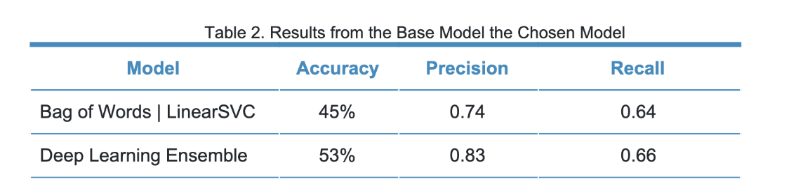
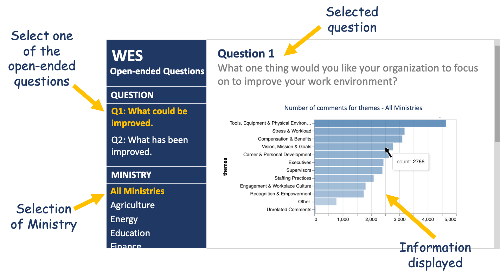
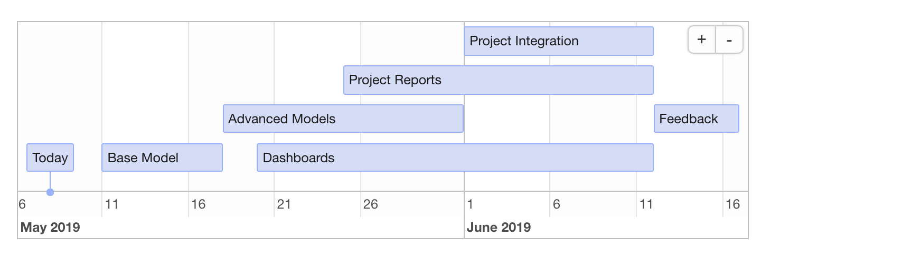

BC Stats Capstone Proposal Report
================
Team Members: Carlina Kim, Karanpal Singh, Sukriti Trehan, Victor
Cuspinera  Partner: Nasim Taba | Mentor: Varada Kolhatkar  
2020-05-11

## Executive Summary

The responses to the open-ended questions from BC Public Service’s Work
Environment Survey (WES) have been manually coded into themes and
sub-themes by BC Stats to identify areas for improvement and understand
employee’s experiences in the working environment. We propose using
natural language processing and machine learning classification
techniques to automate the labelling of text responses with the goals of
improving previously worked on models and scale this process for further
insight. We plan to build a data pipeline for our models and create a
dashboard to display trends across ministries for the qualitative
questions.

## Introduction

Since 2006, the BC Public Service has conducted the Work Environment
Survey (WES) with the goal of understanding their employees’
experiences, celebrating their successes, and identifying areas for
improvement across their 26 ministries. The survey consists of ~80
multiple choice questions using a 5 Likert scale and two open-ended
questions.

Previously, the BC Stats team had been manually coding the responses to
the open-ended questions into themes and subthemes. This task can be
time-consuming and expensive to do manually. Further, BC Stats has not
yet looked into exploring trends across the responses for the second
question. We have broken down our specific objectives for each question
as follows:

**Question 1.**  
*“What one thing would you like your organization to focus on to improve
your work environment?”*

  - To build a model for predicting label(s) for main themes.
  - To build a model for predicting label(s) for sub-themes.
  - To achieve scalability: Identify trends across ministries and over
    years.

**Question 2.**  
*“Have you seen any improvements in your work environment and if so,
what are the improvements?”*

  - To identify labels for theme classification and compare it with
    existing labels.
  - To build a model for predicting label(s) for themes.
  - To create visualizations for executives to explore the results.

In 2019, the UBC-MDS BC Stat’s Capstone team (Quinton, Pearson, Nie) has
addressed the first objective of Question 1 and reached the following
results:

 Source: Final Report of BC Stats
Capstone 2019, by Quinton, Pearson and Nie.

The precision and recall results did not meet the required standards for
a deployable model and thus, our aim is to improve these results for
predicting labels for main themes for Question 1.

## Data Science Techniques

Responses for these open-ended questions are in the form of comments
which have been classified into multiple themes and sub-themes. We have
around 32,000 labelled observations for the first question and around
6,000 labelled observations for the second question which can be used
for addressing our label prediction objectives\[1\]. Further, we have an
additional 9,000 unlabelled comments for the second question which can
be used for creating visualizations to further explore the results.

***Question 1:***

BC Stats team has manually coded the comments into 13 themes and 63
sub-themes. To make an automated classifier for this type of problem,
multi-label classification algorithms seems like the right choice.

As part of the UBC-MDS Capstone 2019 with BCStats, the team proposed
Binary Relevance as a base model with a bag of words representation
using CountVectorizer. Binary Relevance predicts the labels
independently for n-labels in the target variable and then combines
them. One drawback of this classifier is that it does not account for
label correlations.

This year, as our base model, we propose to use TF-IDF representation
along with Classifier Chains. TF-IDF gives higher weights to important
tokens and Classifier Chains preserves the order and occurrence of the
labels.

***Question 2:***

The BC Stats team has coded the comments for this question into 6 themes
and 16 sub-themes but they are not confident with these labels. So, our
first aim will be to identify labels using unsupervised learning and
compare them with the existing labels. Clustering techniques like PCA
and Topic Modelling will be implemented for this task and once the right
labels have been identified, a multi-label classifier can be trained on
this data for automated labelling of comments.

We expect that the final data products consider a data pipeline with the
documentation for our models, and a dashboard app that displays the
trends across ministries for both qualitative questions.

**Dashboard app’s sketch\[2\]**

 

## Timeline

**Capstone Project Timeline**

Additionally, we have scheduled weekly meetings on Tuesdays with BC
Stats, and Thursdays with our MDS-mentor.

## References

  - [BC Stats. (August 2018). 2018 Work Environment Survey Driver
    Guide.](https://www2.gov.bc.ca/assets/gov/data/statistics/government/wes/wes2018_driver_guide.pdf)

  - [BC Stats. (2018). Workforce Profile Report 2018. Online dashboard.
    Retrieved 2020-05-08](https://securesurveys.gov.bc.ca/ERAP/workforce-profiles)

  - [Province of British Columbia. (2020). About the Work Environment
    Survey (WES).
    Retrieved 2020-05-09](https://www2.gov.bc.ca/gov/content/data/statistics/government/employee-research/wes/)

  - [Quinton, A., Pearson, A., Nie, F. (2019). BC Stats Capstone Final
    Report, Quantifying the Responses to Open-Ended Survey Questions.
    GitHub account of Aaron
    Quinton.](https://github.com/aaronquinton/mds-capstone-bcstats/blob/master/reports/BCStats_Final_Report.pdf)

-----

1.   Labelled data availability: 2013, 2018, 2020 for question 1, and
    2018 for question 2.

2.  This figure is just for illustrative purposes, the final version of
    the app could differ from the sketch.
