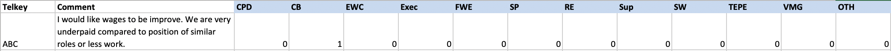

```{r setup, include=FALSE}
knitr::opts_chunk$set(echo = FALSE)
```

## Introduction | Background: Work Environment Survey (WES)

<div class= "columns-2">


<br>  

**Primary goals:**  
 
  - Understand employee experiences 
  - Celebrate successes
  - Identify areas for improvement
  
<br>
80 multiple choice questions (5 point likert scale) and 2 open-ended questions

- around 15,000 respondants per year across 26 ministries
</div>

## Introduction | Qualitative Questions

<b> <span style="color:Darkblue">
1) What one thing would you like your organization to focus on to improve your work environment? </span>
 
<br> <span style="color:Darkblue">
2) Have you seen any improvements in your work environment and if so, what are the improvements?
</span> </b>
<br>
<br>
Theme examples:

- Compensation and Benefits
- Stress and Workload
- Supervisors
- Career and Personal Development
- etc.


## Introduction | Data Example 

**1st Question Comment Example**: 
<span style="color:Darkblue">*“I would like wages to be improve. We are very underpaid compared to position of similar roles or less work.”*</span>  
<br>
**Theme**: Compensation and Benefits <br>
**Sub-theme**: Increase salary  

<br>
Example dataset with comment and themes only




## Objectives 

**Overall goal: <span style="color:Darkblue">  To use automated multi-label theme classification of comments to themes and subthemes </span> **

<span style="color:Darkblue"> 1st Question: </span>

- To improve accuracy for predicting label(s) for main themes respective of previous capstone project results
- To build a model for predicting label(s) for sub themes
- Scalability- To identify trends across ministries and over the four specified years

<span style="color:Darkblue"> 2nd Question: </span> 

- To identify labels for theme classification and compare with existing labels
- To create visualizations for executives to explore the results


## EDA

## Challenges

## Techniques

## Deliverables

## Timeline


