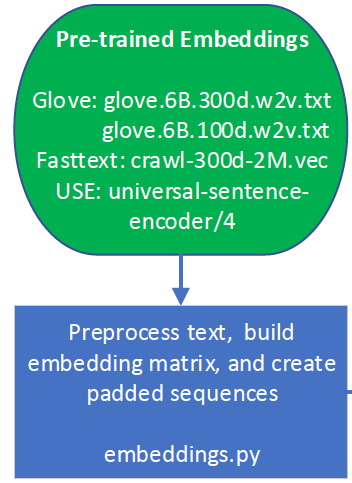
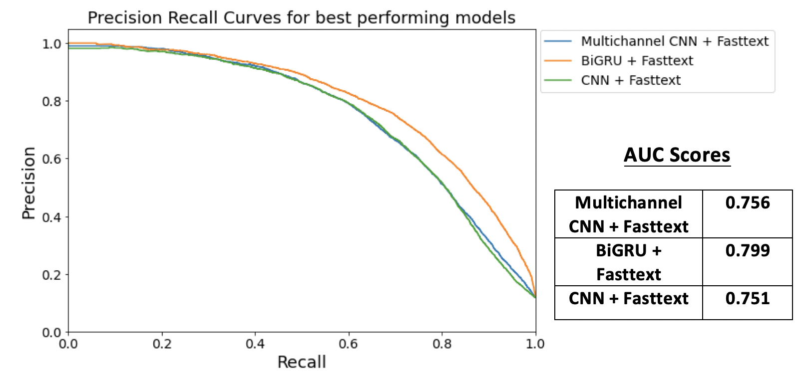
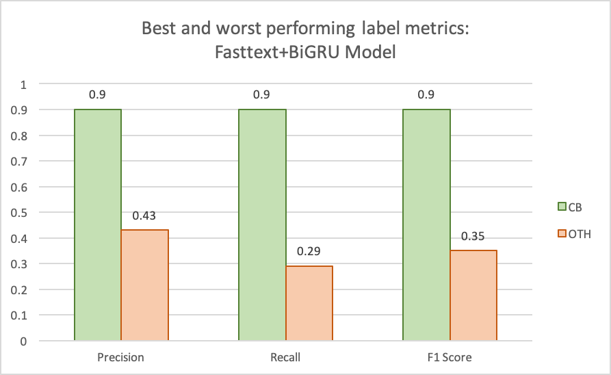
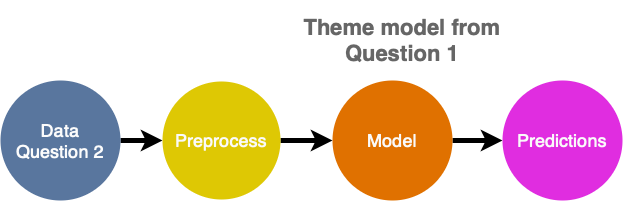

```{r setup, include=FALSE}
knitr::opts_chunk$set(echo = FALSE)
```

```{r load_packages, warning=FALSE}
library(vegawidget)
library(reticulate)
library(timevis)
library(kableExtra)
library(knitr)
use_python('/usr/local/bin/python')
```

```{python libraries_import, include=FALSE}
import pandas as pd
import numpy as np
import altair as alt

```

## Introduction | The Survey

<div class= "columns-2">
<center>

</center>
<br>  

**Work Environment Survey (WES)**  
 
  - conducted by BC Stats for employees within BC Public Service
  
  - measures the health of work environments and identifies areas for improvement
  
  - ~80 multiple choice questions (5 point scale) and 2 open-ended questions
  
</div>


## Data | Open-ended Questions

**Question 1**

- <b> <span style="color:#005c99">
What one thing would you like your organization to focus on to improve your work environment? </span></b>

Example: *"Better health and social benefits should be provided."*

<br>
**Question 2**

- <b> <span style="color:#005c99">
Have you seen any improvements in your work environment and if so, what are the improvements? </span> </b>

Example: *"Now we have more efficient vending machines."*

<br>
<br>

<font size="3"> *Note: these examples are fake comments for privacy reasons. </font>


## Example of Data: Question 1
<font size="3.5"> <b> 
<span style="color:#005c99">
What one thing would you like your organization to focus on to improve your work environment? </span> </b> </font>


|Comments*|CPD|CB|EWC|...|CB_Improve_benefits|CB_Increase_salary|
|:----|:---:|:---:|:---:|:---:|:---:|:---:|
|Better health and social benefits should be provided|0|1|0|...|1|0|

<br>
<font size="4"><span style="color:#005c99">**Theme**: CB = Compensation and Benefits</span></font>

<font size="4"><span style="color:#005c99">**Subtheme**: CB_Improve_benefits = Improve benefits</span></font>
<br>
<br>

**Question 1:** 

  - comments encoded into <span style="color:#005c99">12 themes </span>and <span style="color:#005c99">63 subthemes</span>
  - <span style="color:#005c99">+31,000 </span>labelled comments for 2013, 2018, 2020, <span style="color:#005c99">+12,000 </span>additional comments from 2015

**Question 2:**

  - themes also encoded, but not as reliable as Question 1's
  - <span style="color:#005c99">+6,000 </span>labelled comments for 2018, <span style="color:#005c99">+9,000 </span>additional comments from 2015, 2020

<font size="3"> *Note: this is a fake comment as an example of the data. </font>


## Our Objectives 
<br>
**<font size="5"># 1) Build a model to automate multi-label text classification that: </font> **

- predicts label(s) for Question 1 and 2's main <span style="color:#005c99">themes</span>

- predicts label(s) for Question 1's <span style="color:#005c99">sub-themes</span>

<br>

**<font size="5"># 2) Build an app for visualizations on text data:</font>**

- identify and compare <span style="color:#005c99"> common words </span> used for each question

- identify <span style="color:#005c99"> trends on concerns (Q1) </span>and <span style="color:#005c99">appreciations (Q2)  </span> for BC ministries over the given years 


## Challenges with data| 1) Sparsity

<div class= "columns-2">


<br>


</div>
**<span style="color:#005c99">There are 12 themes and 63 subthemes that comments can be encoded into.</span>**

<font size="4"> 

- Average number of labels per comment: **Themes = ~1.4**  ,  **Subthemes = ~1.6**</font>


## Challenges with data| 2) Class Imbalance
<center>
  
</center>


## Text classification methodology

<center>
  
</center>


## Data Split & Preprocess
<center>
  
</center>
<br>

- Raw -> 80% train, 20% test.   
- Training -> 80% train, 20% validation

<br>

- removed<span style="color:#005c99"> sensitive information </span> using <span style="color:#005c99">Named Entity Recognition (NER) </span>to remove person, organization, location, and geopolitical entity
- changed social media handles from "Facebook", "Instagram", "Twitter" to "social media" 
- removed punctuation and lowercase for tokenization

<br>
<font size="4">Example comment to get flagged: 
<b>"George and I love when the department gives us new coupons!"</b></font>
                

## Baseline Model: Classifier Chains
<center>

</center>
<br>

<span style="color:#005c99"> **TF-IDF Vectorizer**</span> uses weights instead of token counts (CountVectorizer).

<span style="color:#005c99"> **Classifier Chains** </span> is a multi-label classification method which <span style="color:#005c99">preserves order and occurence of labels.</span> 

- ran multiple scikit-learn base classifiers (RandomForest, GaussianNB, etc) 
- best result with <span style="color:#005c99">**LinearSVC**</span>


## Advanced Model: Pre-Trained Embeddings 
<center>

</center>
<br>

#### <span style="color:#005c99">**Fasttext, Glove, Universal Sentence Encoder**</span>

<div class= "columns-2">
<br>
<center>
</center>

<br>

- explored several embeddings on various models

- built embedding matrix & transformed comments to padded sequenced data to fit into embedding size 

- used these saved embeddings on public cloud services as data contains sensitive information


##  How we measured success| Precision & Recall
<div class= "columns-2">
<center>
  
</center>
  
  
  - <span style="color:#005c99">Precision Recall curve: </span> plotting precision vs recall at various threshold rates
  
  - <span style="color:#005c99">Micro-average: </span> weighted average of the precision and recall
</div>

<font size="3">*Source: [Precision and Recall](https://en.wikipedia.org/wiki/Precision_and_recall)*</font>


## Precision Recall Curve for Q1 Theme Models

<center>

</center>


## Advanced Model: Fasttext + BiGRU

<center>

</center>


## Results for Theme Labelling Models

| Model        | Accuracy      | Precision  | Recall  |F1  |
|:---------------|:-------------:|:------:|:------:|:------:|
| TF-IDF + LinearSVC       | 0.50 | 0.79 |   0.63 | 0.70
| Fasttext + BiGRU       | 0.53  |   0.75 |   0.71 | 0.73


<br>
<br>

####<b>Last year's capstone team's results of models:</b>

<br>

| Model        | Accuracy      | Precision  | Recall  |F1  |
|:---------------|:-------------:|:------:|:------:|:------:|
| Bag of Words + LinearSVC    | 0.45 | 0.74 |   0.64  | 0.69
| Ensemble Model       | 0.53  |   0.83 |   0.66 | 0.74


<br>

<font size="3">*Source: [BC Stats Capstone 2019-Final Report, by A. Quinton, A. Pearson, F. Nie](https://github.com/aaronquinton/mds-capstone-bcstats/blob/master/reports/BCStats_Final_Report.pdf)*</font>


## Label Wise Results for Fasttext + BiGRU | Predicting each theme 

<div class= "columns-2">

<center>

</center>
<br> 

- <font size="4">Themes with high F1 scores (CB) can be encoded <span style="color:#005c99">**automatically using the model**</span>, while themes with low score (OTH) should be <span style="color:#005c99">**manually verified**</span> by BC Stats </font>
<br>

- <font size="4">Recommendation to use a <span style="color:#005c99">**combination of machine learning and manual encoding.**</span></font>

</div>


## Building Subtheme Models | Hierarchical approach

<center>


</center>

<br>

**Subthemes are predicted based on the theme(s) our model has assigned to the comment.**


## Precision Recall Plot for Subtheme Models
<center>

</center>

- <font size="4">The minimum desirable of both precision and recall values shared by BC Stats for labelling subthemes was 0.5. </font>
- <font size="4">**All subtheme models surpassed this threshold.**</font>


## Comparing Question 2 to Question 1

<center>

</center>

- <font size="4">Observed a <span style="color:#005c99">**linear trend**</span> in frequency of common words between Question 1 and Question 2.</font>

- <font size="4">Validated <span style="color:#005c99">**using the themes from Question 1 **</span> to label comments from Question 2.</font>


## Question 2: Predicting Themes

<center>

</center>

<br>

<center><font size="4"><span style="color:#005c99">**Results of our model predicting on sample data of Question 2 manually encoded by BC Stats (at 0.4 threshold):**</span></font> </center>

```{r include= FALSE}
q2 <- data.frame(Accuracy = 0.46,
           Precision = 0.77 , 
           Recall = 0.63,
           F1 = 0.69)
kable(q2) %>%
  kable_styling(bootstrap_options = c("striped", "hover")) 

```
<br>

<center>

</center>
</font>


## Dashboard

<center>

</center>


## Methodologies that did not work

- <span style="color:#005c99"> **overfitting**</span> in **CNNs** and **multi-channel CNNs**
- <span style="color:#005c99">**Universal Sentence Encoder**</span> and <span style="color:#005c99">**BERT** </span>embeddings
- <span style="color:#005c99">**Topic modelling** </span> for Question 2 (too much overlap in words, ambiguity)

<center>

</center>


## Recommendations

- observe better results with more **more data** 

- use embeddings and padded data on **public cloud services** (Google Gollab, AWS) to apply complex machine learning algorithms on sensitive data

- **BERT** 

- **Topic modelling** for Question 2 after removing commonly repeated words


## Thank you! Questions?

<center>

</center>

