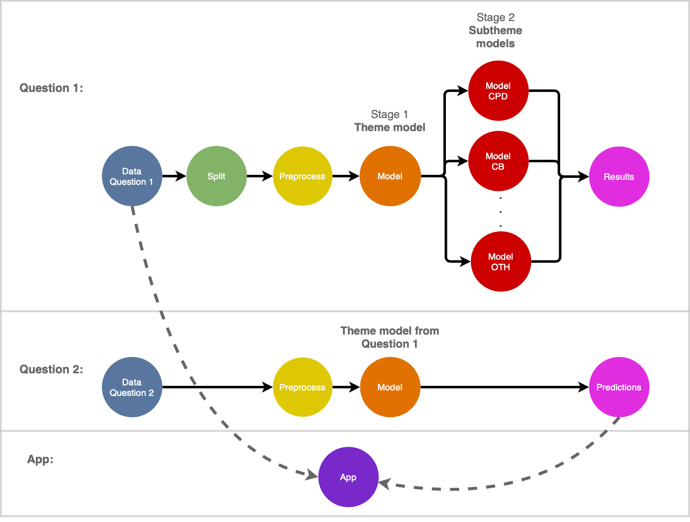
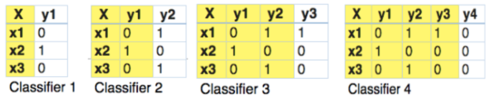
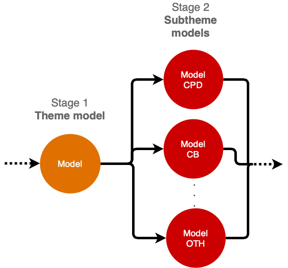

```{r setup, include=FALSE}
knitr::opts_chunk$set(echo = FALSE)
```

```{r load_packages, warning=FALSE}
library(vegawidget)
library(reticulate)
library(timevis)
library(kableExtra)
library(knitr)
use_python('/usr/local/bin/python')
```

```{python libraries_import, include=FALSE}
import pandas as pd
import numpy as np
import altair as alt

```

## Introduction | The Survey

<div class= "columns-2">


<br>  

**Work Environment Survey (WES)**  
 
  - conducted by BC Stats for employees within BC Public Service
  
  - measures the health of work environments and identifies areas for improvement
  
  - ~80 multiple choice questions (5 point scale) and 2 open-ended questions
  
</div>


## Data | Open-ended Question Responses
**Question 1**

- <b> <span style="color:#005c99">
What one thing would you like your organization to focus on to improve your work environment? </span></b>

Example: *"Better health and social benefits should be provided."*

<br>
**Question 2**

- <b> <span style="color:#005c99">
Have you seen any improvements in your work environment and if so, what are the improvements? </span> </b>

Example: *"Now we have more efficient vending machines."*

<br>
<br>

<font size="3"> *Note: these examples are fake comments for privacy reasons. </font>


## Data Example of Question 1
<font size="5"> <b><span style="color:#005c99">
What one thing would you like your organization to focus on to improve your work environment? </span> </b> </font>


|Comments*|CPD|CB|EWC|...|CB_Improve_benefits|CB_Increase_salary|
|:----|:---:|:---:|:---:|:---:|:---:|:---:|
|Better health and social benefits should be provided|0|1|0|...|1|0|
<br>
<font size="5">**Theme**: CB = Compensation and Benefits</font>

<font size="5">**Sub-theme**: CB_Improve_benefits = Improve benefits</font>

<br>

Question 1: <span style="color:#005c99">+31,000 </span>labelled comments for 2013, 2018, 2020, <span style="color:#005c99">+12,000 </span>additional comments from 2015
<br>
<br>
Question 2: <span style="color:#005c99">+6,000 </span>labelled comments for 2018, <span style="color:#005c99">+9,000 </span>additional comments from 2015, 2020

<br>

<font size="3"> *Note: this is a fake comment as an example of the data. </font>


## Objectives 
<br>
**<font size="5"># 1) Build a model to automate multi-label text classification that: </font> **

- predicts label(s) for Question 1 and 2's main <span style="color:#005c99">themes</span>

- predicts label(s) for Question 1's <span style="color:#005c99">sub-themes</span>

<br>

**<font size="5"># 2) Visualizations on discovery of text analysis:</font>**

- mapping words for both questions to <span style="color:#005c99"> identify common texts</span> 

- identify potential<span style="color:#005c99"> needs & resolutions</span> using sentimental analysis

- identify <span style="color:#005c99">theme trends</span> across <span style="color:#005c99">ministries</span> over given years 


## Challenges with data| Sparsity

<div class= "columns-2">


<br>


</div>
**<span style="color:#005c99">There are 12 themes and 63 subthemes that comments can be encoded into.</span>**

<font size="4"> 

- Label cardinality for **themes: ~1.4** and for **subthemes: ~1.6**</font>


## Challenges with data| Class Imbalance
<center>
  
</center>

**<span style="color:#005c99">Imbalanced data in each theme</span>**


## Text classification methodology
<center>
  
</center>


## Data Split & Preprocessing
<center>
  
</center>
<br>

- Raw -> 80% train, 20% test.   
- Training -> 80% train, 20% validation

<br>

- remove<span style="color:#005c99"> sensitive information </span> using <span style="color:#005c99">Named Entity Recognition (NER) </span>to remove person, organization, location, and geopolitical entity from data
- all social media handles to "social media" instead of "Facebook", "Instagram", "Twitter"
- removed punctuation and lowercase for <span style="color:#005c99"> tokenization</span>

<br>
<font size="4">Example comment to get flagged: 
<b>"George and I love when the deparment gives us new coupons!"</b></font>
                

## Baseline Model: Classifier Chains
<center>

</center>
<br>

- <span style="color:#005c99"> **TF-IDF Vectorizer**</span> uses weights instead of token counts (CountVectorizer)

- <span style="color:#005c99"> **Classifier Chains** </span> preserves order and occurence of labels
    - multiple scikit-learn base classifiers tried (RandomForest, GaussianNB, etc) 
    - best result with <span style="color:#005c99">LinearSVC </span> 
<br>

<center>
  
</center>
<br>

<font size="3">*Source: [Multi-Label Classification: Classifier Chains, by Analytics Vidhya](https://www.analyticsvidhya.com/blog/2017/08/introduction-to-multi-label-classification/)*</font>


## Advanced Model: Pre-Trained Embeddings 
<center>

</center>
<br>

#### <span style="color:#005c99">**Fasttext, Glove, Universal Sentence Encoder**</span>

<div class= "columns-2">
<center>
</center>

<br>

- explored several embeddings on various models

- built embedding matrix & maximized vocab coverage for each embedding

- transformed comments to padded data to fit into embedding size

- removed sensitive data using embeddings to upload into public cloud services for our advanced models 


##  How we measured success| Precision & Recall
<div class= "columns-2">
<center>
  
</center>
  
  
  - <span style="color:#005c99">Precision Recall curve: </span> plotting precision vs recall at various threshold rates
  
  - <span style="color:#005c99">Micro-average: </span> weighted average of the precision and recall
</div>

<font size="3">*Source: [Precision and Recall](https://en.wikipedia.org/wiki/Precision_and_recall)*</font>


## Precision Recall Curve for Q1 Themes
<center>

</center>


## Our advanced model: Fasttext + BiGru
<center>

</center>
<br>
<br>

```{r include=FALSE}
df <- data.frame(Threshold = c(0.3, 0.4, 0.5, 0.6, 0.7),
           Accuracy = c(0.513, 0.531, 0.534, 0.534, 0.526),
           Precision = c(0.714, 0.751, 0.781, 0.811, 0.836), 
           Recall = c(0.744, 0.709, 0.674, 0.638, 0.599),
           F1 = c(0.7287, 0.7293, 0.7234, 0.6979, 0.6726))
kable(df) %>%
  kable_styling(bootstrap_options = c("striped", "hover")) %>%
  row_spec(2, bold = T, color = "white", background = "#D7261E")

```

<center>

</center>


## Model Results for Theme Labelling 

| Model        | Accuracy      | Precision  | Recall  |F1  |
|:---------------|:-------------:|:------:|:------:|:------:|
| TFID + LinearSVC       | 0.50 | 0.79 |   0.63 | 0.70
| Fasttext + BiGru       | 0.54  |   0.75 |   0.71 | 0.73


<br>
<br>

<b>2019 Capstone team's results</b>


| Model        | Accuracy      | Precision  | Recall  |
|:---------------|:-------------:|:------:|:------:|
| Bag of Words + LinearSVC    | 0.45 | 0.74 |   0.64  
| Fasttext + BiGru       | 0.53  |   0.83 |   0.66 


<br>

<font size="3">*Source: [BC Stats Capstone 2019-Final Report, by A. Quinton, A. Pearson, F. Nie](https://github.com/aaronquinton/mds-capstone-bcstats/blob/master/reports/BCStats_Final_Report.pdf)*</font>


## Results for Fasttext + BiGru | Predicting each theme 

<div class= "columns-2">

| Theme        | Accuracy      | Precision  | Recall  |
|:---------------|:-------------:|:------:|:------:|
| CPD       | 0.94 | 0.77 |   0.79 |
| CB        |0.97     |   0.90 |   0.90 |
| EWC       | 0.94      |    0.69 |   0.56|
| Exec      | 0.92 | 0.64 |   0.71 |
| FEW       | 0.97 | 0.73 |   0.77 |
| SP        | 0.95 | 0.76 |   0.75 |
|

<br>

| Theme        | Accuracy      | Precision  | Recall  |
|---------------|:-------------:|------:|------:|
| RE        | 0.94 | 0.69 |  0.51 |
| Sup       | 0.92 | 0.66 |   0.57 |
| SW        | 0.92| 0.74 |   0.65 |
| TEPE      | 0.95 | 0.92 |   0.85 |
| VMG       | 0.90 | 0.62 |   0.66 |
| OTH       | 0.96 | 0.43 |   0.29 |
|    

</div>


## Labelling Subthemes

<center>



</center>

<br>

**Subthemes are predicted based on the theme(s) our model has assigned to the comment.**


## Precision Recall Plot for Subtheme Models

<center>

</center>

## Question 2: Predicting Themes
<center>

</center>
<center><font size="3"><span style="color:#005c99">**Results using sample data of Question 2 manually encoded by BC Stats (at 0.4 threshold):**</span></font> </center>

```{r include= FALSE}
q2 <- data.frame(Accuracy = 0.46,
           Precision = 0.77 , 
           Recall = 0.63,
           F1 = 0.69)
kable(q2) %>%
  kable_styling(bootstrap_options = c("striped", "hover")) 

```

<center>

</center>
</font>


## Dashboard

<center>

</center>


## Methodologies that did not work

- <span style="color:#005c99"> **overfitting**</span> in **CNNs** and **multi-channel CNNs**
- <span style="color:#005c99">**USE**</span> and <span style="color:#005c99">**BERT** </span>embeddings
- <span style="color:#005c99">**Topic modelling** </span> for Question 2 (too much overlap in words, ambiguity)

<center>

</center>


## Recommendations

- observed better results with more **more data** 

- Try **BERT** (could not get embeddings due to sentitive data not being able to upload to cloud platforms)

- using embeddings and padded training & validation data on **public cloud services** (Google Gollab, AWS) which can pave way for applying more complex machine learning algorithms on sensitive data

- Topic modelling for Question 2 can be tried out after removing commonly repeated words


## Thank you!


